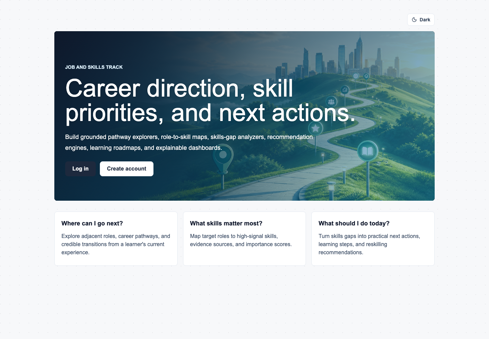
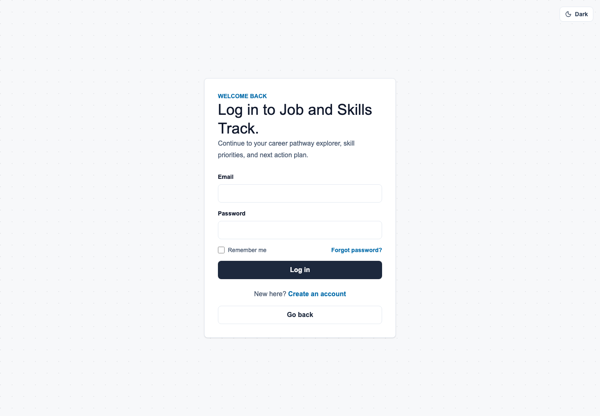
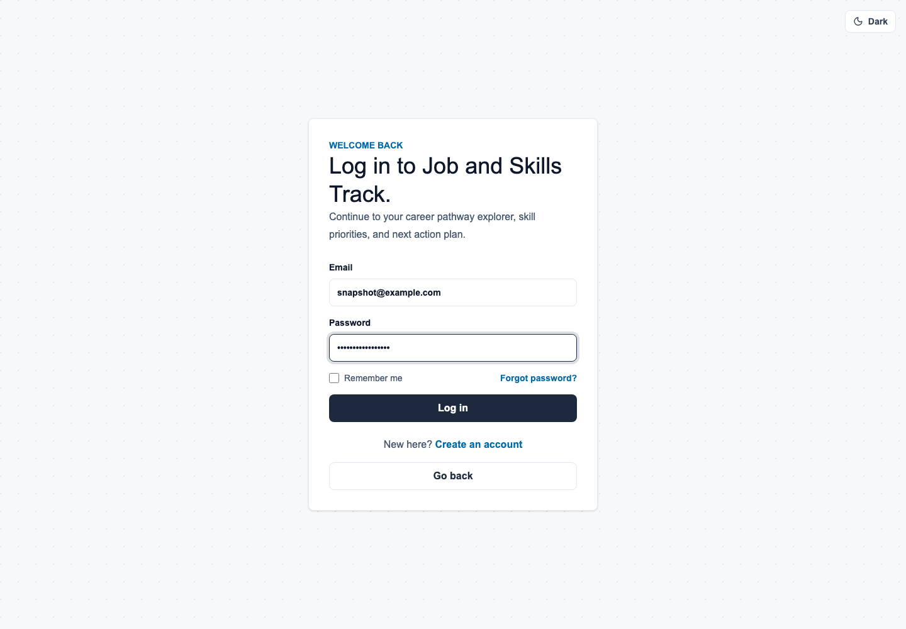
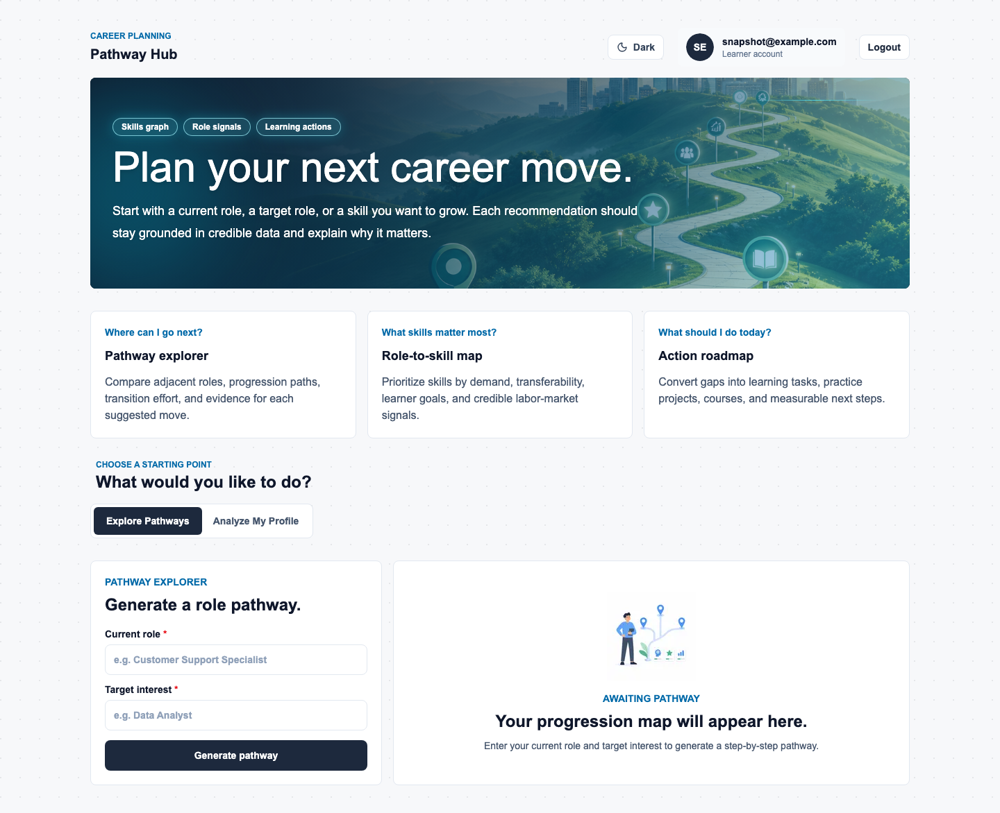
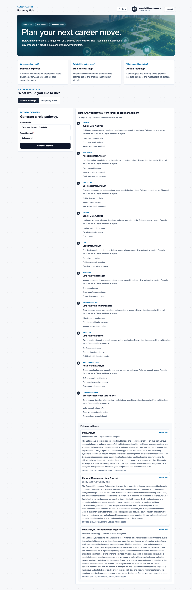
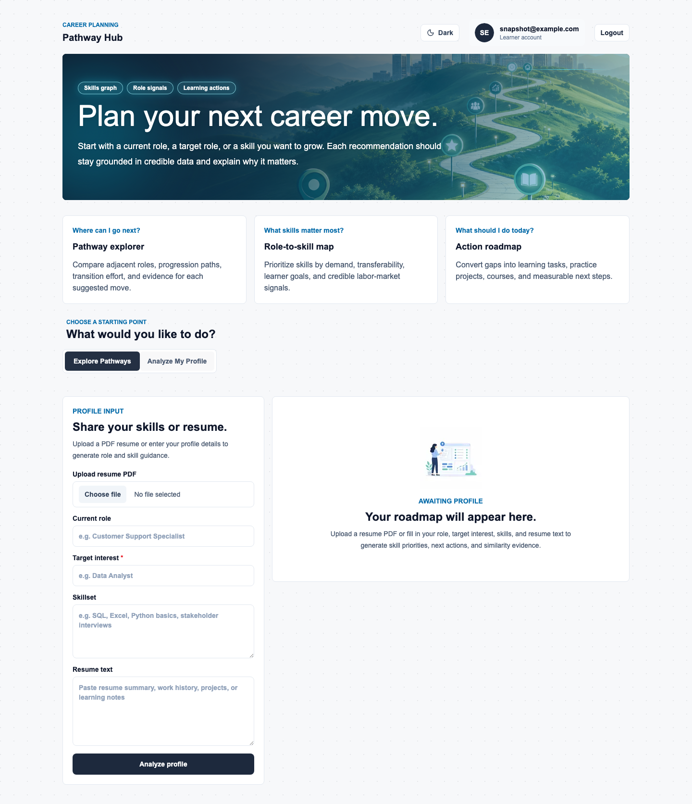
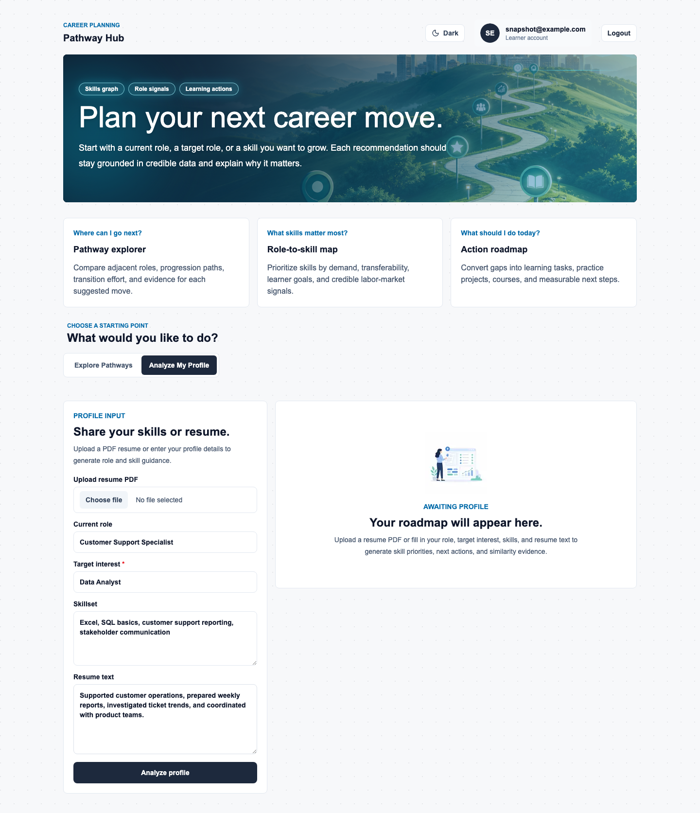
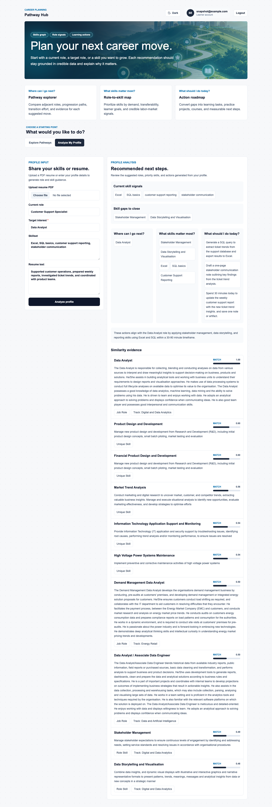

# PyCon 2026 Track 1 Project Summary

This workspace contains the `pycon26` Job and Skills Track application. It is a career pathway and skills intelligence demo that combines a Next.js frontend, a FastAPI backend, local SkillsFuture data, ChromaDB vector retrieval, and a local llama.cpp LLM server.

## What Has Been Done

- Built a monorepo-style application under `pycon26/`.
- Added a FastAPI backend with endpoints for authentication, users, roles, career pathways, learner analysis, resume upload, vector indexing, and vector search.
- Added a Next.js frontend with landing, login, registration, dashboard, learner intake, pathway generation, dark mode, and evidence display.
- Added ChromaDB vector indexing for SkillsFuture job roles, role-skill records, key tasks, and unique skills.
- Added learner analysis that retrieves SkillsFuture evidence first, then generates recommendations through a local LLM.
- Added stricter target interest validation and clearer `404` behavior when a target role is not indexed.
- Added documentation for data provenance, bring-up steps, C4 architecture diagrams, UML diagrams, and Swagger/OpenAPI.
- Generated a Swagger/OpenAPI spec for the backend endpoints.

## Folder Structure

```text
pycon26-track1/
├── README.md
└── pycon26/
    ├── README.md
    ├── AGENTS.md
    ├── apps/
    │   ├── backend/
    │   │   ├── app/
    │   │   │   ├── clients/
    │   │   │   ├── repositories/
    │   │   │   ├── routers/
    │   │   │   ├── schemas/
    │   │   │   ├── services/
    │   │   │   ├── config.py
    │   │   │   ├── db.py
    │   │   │   └── main.py
    │   │   ├── scripts/
    │   │   │   └── join_skills_framework_workbook.py
    │   │   ├── tests/
    │   │   ├── README.md
    │   │   └── pyproject.toml
    │   └── frontend/
    │       ├── app/
    │       ├── components/
    │       ├── lib/
    │       ├── public/
    │       └── package.json
    └── docs/
        ├── architecture-c4.md
        ├── bring-up.md
        ├── data-provenance.md
        ├── openapi.json
        ├── snapshots/
        │   └── README.md
        └── uml-diagrams.md
```

## Important Documents

Project-owned Markdown docs:

- [Root project summary](README.md): top-level summary, folder structure, snapshot links, and quick start.
- [Application README](pycon26/README.md): monorepo app overview and local development commands.
- [Agent guide](pycon26/AGENTS.md): repository guidance for coding agents.
- [Backend README](pycon26/apps/backend/README.md): backend commands, endpoint notes, vector settings, and local LLM settings.
- [Bring-up guide](pycon26/docs/bring-up.md): download data, index ChromaDB, run llama.cpp, start backend/frontend, and open Swagger.
- [Data provenance](pycon26/docs/data-provenance.md): SkillsFuture source files, transformation flow, and retrieval flow.
- [C4 architecture diagrams](pycon26/docs/architecture-c4.md): C1 system context and C2 container diagrams.
- [UML diagrams](pycon26/docs/uml-diagrams.md): learner analysis class and sequence diagrams.
- [Snapshot guide](pycon26/docs/snapshots/README.md): description of captured UI flow screenshots and regeneration command.

Other generated docs/artifacts:

- [Swagger/OpenAPI spec](pycon26/docs/openapi.json): generated backend API spec.
- [UI snapshots](pycon26/docs/snapshots/): captured PNG screenshots for the primary user flow.
- [UI flow recording](pycon26/docs/videos/skillcompass-full-demo-flow.mp4): YouTube-ready MP4 walkthrough covering Explore Pathways, manual profile analysis, PDF upload with `accountant` target interest, and slow full-result scrolling.

## UI Flow Snapshots

The primary user flow is captured under `pycon26/docs/snapshots/`:

### Landing Page



### Login Page



### Login Form Filled



### Dashboard Pathway Empty State



### Pathway Result



### Profile Analysis Empty State



### Profile Analysis Form



### Profile Analysis Result



## Quick Start

Backend:

```sh
cd pycon26/apps/backend
uv sync
uv run uvicorn app.main:app --reload
```

Frontend:

```sh
cd pycon26/apps/frontend
pnpm install
pnpm dev
```

Swagger UI:

```text
http://localhost:8000/docs
```
