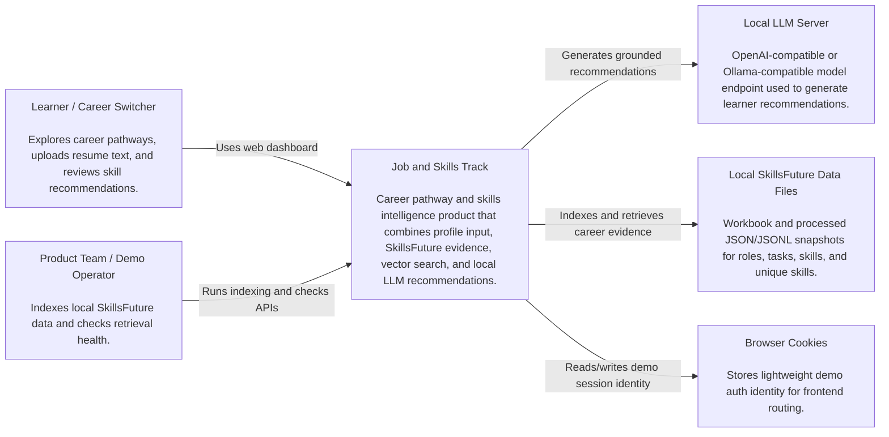
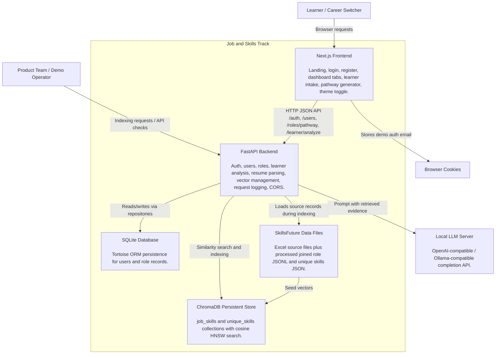

# C4 Architecture Diagrams

These diagrams describe the Job and Skills Track application at C4 levels C1 and C2.

## C1: System Context

## C2: Container Diagram

## Notes

- The frontend defaults to `NEXT_PUBLIC_API_BASE_URL=http://localhost:8000`.
- The backend defaults to SQLite at `DATABASE_URL=sqlite://db.sqlite3`.
- ChromaDB is configured by `VECTOR_DB_PATH`, `VECTOR_DB_COLLECTION`, `VECTOR_DB_UNIQUE_SKILLS_COLLECTION`, and `VECTOR_DB_HNSW_SPACE`.
- Learner recommendations are grounded by vector evidence first, then generated by the configured local LLM.
