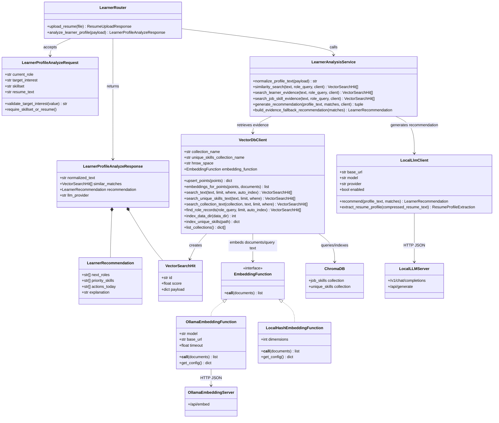
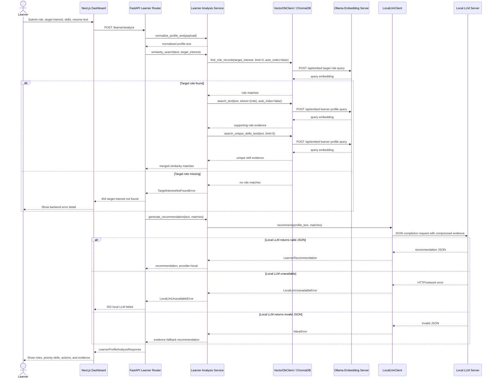

# UML Diagrams

These UML diagrams focus on the learner analysis flow and its main backend collaborators.

## Learner Analysis Class Diagram

## Learner Analysis Sequence Diagram

## Scope

- The class diagram shows implementation-level collaborators for the learner analysis use case.
- The sequence diagram shows the primary `/learner/analyze` runtime flow, including embedding-backed retrieval, target-role misses, and local LLM fallback behavior.
- The sequence starts from the dashboard user journey after login and ends with the dashboard outcome: recommended roles, priority skills, actions, explanation, and retrieved evidence.
- The default runtime uses Ollama `nomic-embed-text` for ChromaDB document/query embeddings, while tests can use the deterministic local hash embedding function.
